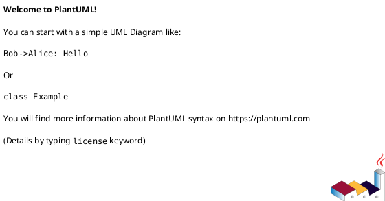

<div align="center">
  
</div>

A terminal-based, interactive programming exercise runner. Inspired by [Rustlings](https://github.com/rust-lang/rustlings) and [100 Exercises to Learn Rust](https://rust-exercises.com/), LangQuest extends the concept to multiple languages - work through hands-on exercises in **Rust**, **Go**, **C++**, **Python**, **RISC-V assembly**, and **Markdown** with real-time feedback, progress tracking, and a built-in hint system.


## Table of Contents

- [Features](#features)
- [Installation](#installation)
  - [Installing lq](#installing-lq)
  - [Installing the Latest GitHub Release (HEI)](#installing-the-latest-github-release-HEI)
  - [Uninstalling the Release-Installed Binary](#uninstalling-the-release-installed-binary)
  - [Exercise Toolchains](#exercise-toolchains)
- [Getting Started](#getting-started)
  - [Creating Your Exercise Repository](#creating-your-exercise-repository)
  - [Launching lq](#launching-lq)
  - [Configuration & progress files](#configuration--progress-files)
  - [Progress, identity & syncing](#progress-identity--syncing)
  - [Teacher vs student repos (encrypted solutions)](#teacher-vs-student-repos-encrypted-solutions)
- [Creating Your Own Exercises](#creating-your-own-exercises)
  - [File Structure](#file-structure)
  - [Exercise Contents](#exercise-contents)
- [CLI Reference](#cli-reference)
- [Dependencies](#dependencies)
- [License](#license)

## Features

- **Multi-language support** - Rust, Go, C++, Python, RISC-V assembly, and Markdown/conceptual exercises
- **Live verification** - file saves trigger immediate re-runs; results stream into the TUI without leaving the editor
- **Paged exercise view** - Theory → Task → Output → Solution, navigated with arrow keys
- **Progressive hints** - reveal hints one at a time; after all hints, optionally unlock the full solution
- **Syntax-highlighted solutions** - reference code and prose explanations, gated until pass or explicit unlock
- **Overview with tree panel** - scrollable exercise table and module/exercise tree with live progress
- **Persistent progress** - encrypted, GitHub-account-bound `.lq.progress` file tracks scores, pass status, and solution visibility (tamper-resistant; not shareable between students)

## Installation

### Installing lq

**Prerequisites:**
- Rust toolchain (edition 2024, Rust ≥ 1.88)
- Build tools for your language exercises (see [Exercise Toolchains](#exercise-toolchains))
  - `rustc` for rust exericses
  - `go` for Go exercises
  - `g++` and Catch2 for C/C++ exercises
  - `python3` and `pytest` for Python exercises
  - Oracle Java JDK 21 and plantuml.jar for PlantUML exercises

```sh
# Clone and install
git clone https://github.com/tschinz/langquest.git
cd langquest
cargo install --path .

# Or run directly without installing
cargo run -- --repo /path/to/exercises

# of via crates.io
cargo install langquest
lq --repo /path/to/exercises
```

### Installing the Latest GitHub Release (HEI)

LangQuest embeds encryption/sealing keys at build time. For classroom/student consistency you usually want the exact CI-produced binary from GitHub Releases, not a local source build that may embed different keys.

The `scripts/install_latest_release.xx` scripts download the **latest release** from `https://github.com/tschinz/langquest/releases` which contain custom keys used within the HEI courses.

They auto-detect the platform/architecture, fetch the matching asset, install the binary, and print the resulting version.

#### macOS / Linux

Run:

```sh
curl -fsSL https://raw.githubusercontent.com/tschinz/langquest/refs/heads/main/scripts/install_latest_release.sh | sh
```

Default install path:

- `~/.local/bin/lq`

Override install path:

```sh
INSTALL_DIR=/usr/local/bin curl -fsSL https://raw.githubusercontent.com/tschinz/langquest/refs/heads/main/scripts/install_latest_release.sh | sh
```

Script file:

- `scripts/install_latest_release.sh`

#### Windows (PowerShell)

Run:

```powershell
irm https://raw.githubusercontent.com/tschinz/langquest/refs/heads/main/scripts/install_latest_release.ps1 | iex
```

Default install path:

- `%LOCALAPPDATA%\Programs\lq\bin\lq.exe`

Override install path:

```powershell
$env:INSTALL_DIR = 'C:\\Tools\\lq\\bin'
irm https://raw.githubusercontent.com/tschinz/langquest/refs/heads/main/scripts/install_latest_release.ps1 | iex
```

Script file:

- `scripts/install_latest_release.ps1`

#### Notes

- The installer scripts use GitHub's `releases/latest` metadata and do not require you to specify a tag manually.
- If the install directory is not already on your `PATH`, the script adds it.

### Uninstalling the Release-Installed Binary

If you installed with the release scripts, uninstall by removing the installed binary from the install directory.

#### macOS / Linux

Default uninstall:

```sh
rm -f ~/.local/bin/lq
```

If you installed with a custom path, remove it from that directory instead:

```sh
rm -f /your/custom/install/dir/lq
```

Optional PATH cleanup in startup files (only if you no longer want the path):

```sh
sed -i.bak '/# Added by lq installer/,+1d' ~/.bashrc ~/.bash_profile ~/.zshrc ~/.zprofile ~/.profile 2>/dev/null || true
```

#### Windows (PowerShell)

Default uninstall:

```powershell
Remove-Item "$env:LOCALAPPDATA\Programs\lq\bin\lq.exe" -Force -ErrorAction SilentlyContinue
```

If you installed with a custom path, remove that file instead:

```powershell
Remove-Item "C:\\your\\custom\\install\\dir\\lq.exe" -Force
```

Optional PATH cleanup (remove the installer path from user PATH):

```powershell
$dir = Join-Path $env:LOCALAPPDATA "Programs\lq\bin"
$paths = ([Environment]::GetEnvironmentVariable("Path", "User") -split ';') | Where-Object { $_ -and $_ -ne $dir }
[Environment]::SetEnvironmentVariable("Path", ($paths -join ';'), "User")
```

#### Verify Uninstall

```sh
command -v lq || echo "lq not found"
```

```powershell
Get-Command lq -ErrorAction SilentlyContinue
```

### Exercise Toolchains

Depending on which languages your exercises use, install the corresponding toolchains:

| Language | Installation |
|----------|--------------|
| **Rust** | Install via [rustup](https://rustup.rs/) |
| **Python** | Install Python 3.x and pytest: `pip install pytest` |
| **Go** | Install from [go.dev](https://go.dev/dl/) or via package manager |
| **C++** | `g++` (Xcode CLT / `apt install g++`) and [Catch2](https://github.com/catchorg/Catch2) (`brew install catch2` / `apt install catch2`) |
| **RISC-V** | GNU toolchain (`apt install gcc-riscv64-linux-gnu`) or [Ripes](https://github.com/mortbopet/Ripes) simulator |
| **PlantUML** | [Oracle Java JDK 21](https://www.oracle.com/java/technologies/downloads/) (`java` on PATH) and the `PLANTUML_JAR` environment variable pointing to `plantuml.jar` (or set `plantuml.bin` in `lq.toml`) |
| **Markdown** | No additional tools required - verification is regex-based |

> **Quick setup:** Run `just setup` to install all toolchains automatically (macOS, Linux, and Windows supported).

## Getting Started

### Creating Your Exercise Repository

Create a new directory for your exercises. The structure follows a simple **modules → exercises** hierarchy:

```
my-exercises/
├── lq.toml                      ← toolchain commands (plaintext, auto-created)
├── .lq.progress                 ← encrypted progress (auto-created; commit to sync)
├── .lq.attest                   ← machine-bound identity cache (git-ignore this)
├── 01-basics/                   ← module (prefixed with NN-)
│   ├── 01-hello-world/          ← exercise (prefixed with NN-)
│   │   ├── 01-theory.md
│   │   ├── 02-task.md
│   │   ├── main.rs
│   │   └── solution/
│   │       ├── main.rs
│   │       └── solution.md
│   └── 02-variables/
│       └── ...
└── 02-control-flow/
    └── ...
```

**Naming conventions:**
- Module and exercise directories must be prefixed with a two-digit number (`01-`, `02-`, …)
- Use lowercase kebab-case: `01-hello-world`, `02-variables`
- Directories without the numeric prefix are ignored

### Launching lq

```sh
# Point lq at your exercise repository
lq --repo /path/to/my-exercises

# Or cd into the repo first
cd /path/to/my-exercises
lq
```

### Configuration & progress files

`lq` manages three files at the root of your exercise repository, split by purpose:

| File | Contents | Format | Commit? |
| --- | --- | --- | --- |
| `lq.toml` | Toolchain commands (`rust.cmd`, `python.cmd`, …) | Plaintext TOML | Yes — shareable |
| `.lq.progress` | Scores, pass state, hints, current exercise | **Encrypted**, identity-bound | Yes — see syncing below |
| `.lq.attest` | Machine-bound proof of your last online identity check | **Encrypted** | **No — never commit** |

`lq.toml` is the only hand-editable file; it holds no progress and is safe to
customise:

```toml
[rust]
cmd = "rustc --edition 2024 --test <file> -o <out>"

[python]
cmd = "python3 -m pytest <file> --tb=short -q"

[plantuml]
bin = "~/.local/bin/lq/plantuml.jar"
cmd = "java -jar <plantuml> -tpng <file>"

[ripes]
bin = "/Applications/Ripes.app/Contents/MacOS/Ripes"
cmd = "ripes --mode cli -t asm --proc RV32_SS --json --src <file>"

[ide]
bin = "/usr/local/bin/zed"          # your editor; auto-detected on first run
cmd = "<ide> <file>"
```

The **`e`** shortcut opens the current exercise's source file in the editor
configured under `[ide]` (and PlantUML previews open there too). `ide.bin`,
`ripes.bin`, and `plantuml.bin` are auto-populated with a platform-appropriate
default the first time `lq` runs — Zed or VS Code for the IDE, the discovered
Ripes app for RISC-V, and the `PLANTUML_JAR` environment variable for PlantUML
— and can be edited to point elsewhere. When no IDE is found, `e` falls back to
the OS default handler.

**Persistence rules (progress):**
- `best_score` only increases - lower scores never overwrite higher ones
- `passed` becomes `true` when `score >= threshold` and never resets
- `solution_seen` becomes `true` on first Solution page visit and never resets

### Progress, identity & syncing

Progress lives in the encrypted `.lq.progress` file, not in `lq.toml`, so it
**cannot be edited by hand** — tampering fails an integrity check and `lq`
refuses to start. Progress is also **bound to your GitHub account** (via the
`gh` CLI): it will not open under a different account, so a solved file cannot be
shared between students.

- **First launch requires internet** (and `gh auth login`) once, to bind your
  progress to your GitHub identity.
- **Offline afterwards works** via a machine-bound attestation cached on each
  machine's first online launch (valid for 30 days).

**For teachers — reading progress.** The read-only commands `lq -s` (stats) and
`lq status` are **not** identity-gated: you can run them against any student's
repository to inspect their progress. Both print the **bound owner**
(`Owner: <login> (GitHub #<id>)`) decrypted from the tamper-proof file, so you
can confirm the progress belongs to the expected student. Because the owner is
sealed inside the encrypted blob, a student who copies a classmate's solved
`.lq.progress` into their own repo will still show the *classmate's* owner — the
swap is immediately visible. Doing exercises (the interactive TUI) remains bound
to the student's own GitHub account, so a copied file cannot be continued as
one's own.

Running `lq -s` also writes a machine-readable **`results.toml`** at the repo
root — the full evaluation in a form that is easy to script grading against. It
contains the bound student identity, overall and per-module summaries, and a
per-exercise record (`passed`, `best_score`, `solution_seen`, hint counts, …):

```toml
[meta]
generated_at = 1786454786
lq_version = "0.1.0"

[student]
verified = true
login = "alice"
github_id = 4242

[summary]
total_exercises = 9
completed = 7
tests_passed = 38     # unit tests passed across all exercises …
tests_total = 45      # … out of this many — enables partial-credit grading
solutions_seen = 0
hints_shown = 0
hints_explored = 0
hints_total = 171
average_best_score = 0.82
times_saved = 21

[modules.01-intro]
total = 3
completed = 2
tests_passed = 11
tests_total = 13
solutions_seen = 0
hints_shown = 2
times_saved = 21
average_best_score = 0.85

[[exercises]]
path = "01-rust/01-hello-world"
name = "Hello world!"
language = "rust"
difficulty = 1
passed = true
best_score = 1.0
tests_passed = 3      # per-exercise test counts (from the last/best run)
tests_total = 3
solution_seen = false
hints_shown = 0
times_saved = 10
hints_revealed = 0
hints_total = 3
```

The `tests_passed` / `tests_total` counts (also shown in the terminal `-s`
output and per module) let you award partial credit for an "almost finished"
exercise — a student who passes 3 of 4 unit tests still gets most of the points.

`tests_total` is counted **statically** from the test source, so the total is
known before an exercise is ever verified (it shows `0/N`, not `0/0`):

| Language | Tests counted from |
| --- | --- |
| Rust | `#[test]` attributes in `main.rs` |
| Go | `func Test…` in `main_test.go` |
| C++ | `TEST_CASE(` in `main_test.cpp` (Catch2) |
| Python | `def test…` in `main.py` |
| RISC-V | `# EXPECT_REG:` / `; EXPECT_REG:` directives in `main.asm` |

`tests_passed` is the number satisfied at the student's best verification.

`results.toml` is a regenerable export (not read back by `lq`); the trust anchor
remains the encrypted `.lq.progress`, so generate it yourself from each
student's repo rather than trusting a committed copy.

**Using multiple machines** (e.g. home PC + school laptop): because progress is
bound to your GitHub *account* — not the machine — you can work on any machine
signed into the same account. Since each student works in **their own fork**,
the clean way to sync is to commit `.lq.progress`:

```sh
# End of a session
git add .lq.progress && git commit -m "progress" && git push
# Start of the next session, on the other machine
git pull
```

Notes:
- Add `.lq.attest` to your exercise repo's `.gitignore` — it is machine-specific
  and each machine regenerates its own; never commit it.
- `.lq.progress` is an encrypted binary blob, so git cannot *merge* two versions.
  Always **pull before** a session and **push after** to avoid conflicts from
  working on both machines at once.
- Committing `.lq.progress` is safe even in a public fork: it is encrypted and
  account-bound, so nobody can read your scores or reuse the file.

See [`docs/exercise-repo.gitignore`](docs/exercise-repo.gitignore) for a ready
`.gitignore` to drop into your exercise repository.

### Teacher vs student repos (encrypted solutions)

Exercise repositories can be published in two tiers:

- **Teacher repo** — the source of truth. `solution/solution.md` and
  `solution/main.*` are readable plaintext.
- **Student repo** — a published copy where the contents of every `solution/`
  directory are **encrypted**, so students cannot read solutions by opening the
  files, browsing the repo on GitHub, or `grep`-ing the tree. They can still
  reveal a solution *inside* LangQuest (which is tracked as `solution_seen`).

LangQuest reads **either** form transparently — a sealed file is detected by its
magic header and decrypted at load time — so the same binary works against both
repos with no configuration.

Seal a repository in place with:

```sh
lq seal-solutions --repo /path/to/repo   # encrypt every solution/ file (idempotent)
```

Only files under a `solution/` directory are affected; student working files,
`02-task.md`, and `01-theory.md` are left untouched.

There is deliberately **no** `unseal` command in `lq` — otherwise a student could
bulk-decrypt every solution from their sealed repo. The teacher's private repo
holds the plaintext solutions and is the source of truth.

**Automating it.** Keep the teacher repo private and let CI publish the sealed
student repo on every push. A ready-to-adapt GitHub Actions workflow is provided
in [`docs/publish-student-repo.yml`](docs/publish-student-repo.yml): it installs
`lq`, runs `lq seal-solutions`, and pushes the sealed tree to a separate student
repository.

> As with progress encryption, the sealing key is embedded in the `lq` binary,
> so this prevents casual reading of solutions rather than defeating a determined
> reverse-engineer.

## Creating Your Own Exercises

### File Structure

Each exercise lives in its own directory within a module:

```
<NN>-<module>/
└── <NN>-<exercise>/
    ├── 01-theory.md           ← optional background reading
    ├── 02-task.md             ← required task description with frontmatter
    ├── main.<ext>             ← student source file (rs, go, cpp, py, md, asm, puml)
    └── solution/
        ├── main.<ext>         ← reference solution
        └── solution.md        ← hints and explanation
```

### Exercise Contents

#### 01-theory.md (Optional)

Background reading rendered on the Theory page. Plain Markdown, no special requirements.

#### 02-task.md (Required)

The task description with **required TOML frontmatter**:

```markdown
---
id          = "hello_world"
name        = "Hello, World!"
language    = "rust"
difficulty  = 2
description = "Implement a function that returns a greeting string."
topics      = ["functions", "strings", "return_values"]
---

# Hello, World!

Your task is to implement the `greeting()` function so that it returns
the string `"Hello, World!"` exactly.
```

| Field         | Type                                             | Description |
|---------------|--------------------------------------------------|-------------|
| `id`          | string                                           | Unique snake_case identifier (key in `lq.toml`) |
| `name`        | string                                           | Display name in the exercise table |
| `language`    | string (`rust`, `go`, `cpp`, `python`, `riscv`, `plantuml`, `text`) | language type of exercise |
| `difficulty`  | integer (1-5)                                    | Shown as stars in the Overview |
| `description` | string                                           | One-line summary |
| `topics`      | array                                            | Tags shown in the Topics column |

#### Student Source File (main.*)

The file extension determines the language and verification method:

**Rust** (`main.rs`) - Uses `#[test]` functions with `// TODO` markers:

```rust
// TODO: implement the add function
fn add(a: i32, b: i32) -> i32 {
    todo!()
}

#[cfg(test)]
mod tests {
    use super::*;

    #[test]
    fn test_add_positive() {
        assert_eq!(add(2, 3), 5);
    }

    #[test]
    fn test_add_negative() {
        assert_eq!(add(-1, 1), 0);
    }
}
```

**Go** (`main.go` + `main_test.go`) - Uses `testing.T` functions:

```go
// TODO: implement the Add function
func Add(a, b int) int {
    return 0
}
```

**C++** (`main.cpp` + `main_test.cpp`) - Uses [Catch2](https://github.com/catchorg/Catch2) test cases:

```cpp
// main.cpp - student source
#include <string>

// TODO: implement the greeting function
std::string greeting() {
    return "";
}
```

```cpp
// main_test.cpp - test file (provided, not edited by student)
#include <catch2/catch_test_macros.hpp>
#include <string>

std::string greeting();

TEST_CASE("greeting returns correct string", "[greeting]") {
    REQUIRE(greeting() == "Hello, World!");
}
```

**Python** (`main.py`) - Uses unittest or pytest:

```python
# TODO: implement the add function
def add(a: int, b: int) -> int:
    pass

def test_add_positive():
    assert add(2, 3) == 5

def test_add_negative():
    assert add(-1, 1) == 0
```

**RISC-V Assembly** (`main.asm`) - Uses `EXPECT_*` directives:

```asm
# EXPECT_REG: x7 42

# TODO: implement the program
# your code here
```

| Directive | Description |
|-----------|-------------|
| `EXPECT_REG: <name> <value>` | register name and expected 32-bit value |

**Markdown** (`main.md`) - Free-text answers matched against keywords:

```markdown
# Question: What keyword makes a Rust variable mutable?

<!-- Write your answer below -->

```

> **Note:** The `<!-- Write your answer below -->` marker line is **mandatory** for text exercises. Keywords are only searched in the content that appears after this marker, so students can read the question without accidentally matching keywords in it.

**PlantUML** (`main.puml`) - Diagrams graded by fuzzy similarity to `solution/main.puml`:



On save the diagram is rendered to `main.png`. It is opened once in the configured `[ide]` (or the OS default image viewer if none is found); later saves re-render the file in place, which the editor auto-reloads, so no duplicate tabs are opened. Rendering requires Oracle Java JDK 21 on PATH and the `PLANTUML_JAR` environment variable pointing to `plantuml.jar`; set `plantuml.bin` in `lq.toml` to override the jar path. Scoring is order-insensitive and tolerant of minor differences, with a `0.8` pass threshold.

Get the latest PlantUML jar from [https://plantuml.com/download](https://plantuml.com/download) and set the environment variable or the `plantuml.bin` path in `lq.toml`:

```sh
export PLANTUML_JAR=/path/to/plantuml.jar
```

#### Solution Folder

**solution/main.*** - The complete reference solution:

```rust
fn add(a: i32, b: i32) -> i32 {
    a + b
}

#[cfg(test)]
mod tests {
    use super::*;

    #[test]
    fn test_add_positive() {
        assert_eq!(add(2, 3), 5);
    }

    #[test]
    fn test_add_negative() {
        assert_eq!(add(-1, 1), 0);
    }
}
```

**solution/solution.md** - Hints, keywords, and explanation with frontmatter:

```markdown
---
title    = "Adding Numbers"
hints    = [
    "The function should return the sum of both parameters.",
    "Use the + operator to add two integers.",
    "Rust returns the last expression without a semicolon.",
]
keywords = ["mut", "let", "i32"]
---

## Explanation

To add two numbers in Rust, simply use the `+` operator. The function
returns the last expression automatically when there's no semicolon.

The `keywords` array is used for Markdown/conceptual exercises to score
free-text answers via regex matching.
```

| Field | Description |
|-------|-------------|
| `title` | Display name for the solution |
| `hints` | Ordered list revealed one at a time with `h` |
| `keywords` | Regex patterns for scoring Markdown exercises |
| body | Prose explanation shown on the Solution page |

## CLI Reference

```
LangQuest - interactive programming exercises

Usage: lq [OPTIONS] [COMMAND]

Commands:
  status          Print current exercise and overall progress
  seal-solutions  Encrypt every `solution/` file in place (teacher → student repo, for CI)
  help            Print this message or the help of the given subcommand(s)

Options:
  -r  --repo <REPO>  Path to exercise repository root
      --reset        Wipe all progress in lq.toml and start fresh
  -s, --stats        Display detailed statistics about exercise progress
  -k, --keys         Print version and hashes of embedded crypto keys
  -t, --toolchain    Print the toolchain report (lq.toml location + tool status), then exit
      --grade        Grade student; Read-only progress file
  -h, --help         Print help
  -V, --version      Print version
```

**Examples:**

```sh
# Launch TUI with exercise repository
lq --repo /path/to/exercises

# Check progress without launching TUI
lq status

# Detailed progress statistics + write machine-readable results.toml
# (teachers can run this on any student repo)
lq -s --repo /path/to/student-repo

# Print lq version + SHA-256 fingerprints of embedded crypto keys
lq --keys

# Reset all progress (prompts for confirmation)
lq --reset

# Seal all solution/ files for the student distribution (see CI workflow in docs/)
lq seal-solutions --repo /path/to/repo
```

After student is done:

```sh
# Check student solutions without writting anything to the progress file or any
# Github identity check
lq --grade --repo /path/to/exercises
```

## Dependencies

| Crate | Purpose |
|-------|---------|
| `ratatui` | TUI rendering framework |
| `crossterm` | Cross-platform terminal backend |
| `clap` | CLI argument parsing |
| `notify` | File-system watcher for live verification |
| `syntect` | Syntax highlighting on the Solution page |
| `pulldown-cmark` | Markdown rendering |
| `toml` + `serde` | Configuration and frontmatter parsing |
| `serde_json` | JSON serialization |
| `regex` | Keyword matching for Markdown exercises |
| `anyhow` | Error propagation |
| `thiserror` | Typed domain errors |
| `chacha20poly1305` | Encryption for progress and sealed solutions |
| `sha2` | SHA-256 hashing for key derivation and integrity checks |

### Build dependencies
| Crate | Purpose |
|-------|---------|
| `dotenvy` | Load `.env` file for secret keys |
| `sha2` | Hash embedded secret keys |
| `hex` | Hex-encode key fingerprints |

### Test dependencies
| Project name | Purpose |
|--------------|---------|
| [`catch2`](https://github.com/catchorg/Catch2) | For C++ tests |

## License

This project is licensed under the MIT License - see the [LICENSE](LICENSE) file for details.
