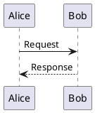

# Sequence Diagrams in PlantUML

A **sequence diagram** shows how participants exchange messages over time.

- `->` is a synchronous message (solid arrow).
- `-->` is a reply / return message (dashed arrow).
- Participants are created implicitly the first time they are named.
- Text after the `:` is the message label.

Wrap the whole diagram between `@startuml` and `@enduml`.
