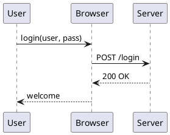

---
title    = "Login Sequence Diagram"
hints    = [
    "Name the three participants: User, Browser, Server.",
    "Use `->` for requests and `-->` for replies.",
    "Message text goes after the colon, e.g. `Browser -> Server: POST /login`.",
    "Order: login → POST /login → 200 OK → welcome.",
]
keywords = [
    "w/User -> Browser: login(user, pass)/",
    's/User\s*->\s*Browser\s*:\s*login\s*\(\s*user\s*,\s*pass\s*\)/',
    "User",
    "Browser",
    "Server",
    "s/[^-]->/",
    "-->",
    "POST /login",
    "200 OK",
    "welcome",
]
---

## Explanation

A login flow is a classic sequence diagram: three participants exchanging four
messages, two requests (`->`) and two replies (`-->`).

**Key concepts:**
- Participants are implicit — first use of a name creates it.
- `->` synchronous message, `-->` reply/return.
- The label after `:` is free text.
- Grading is by keyword matching.
